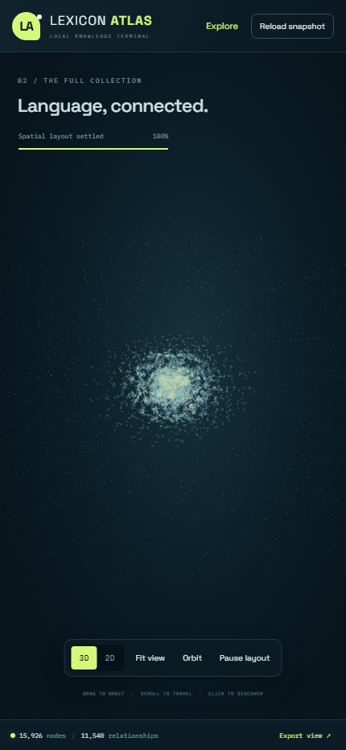

# Lexicon Atlas

### An English word knowledge graph, explored in three dimensions

Words are not isolated dictionary entries. They share roots, borrow forms across
languages, develop meanings, and leave traces of their history. Lexicon Atlas
makes those connections visible in one explorable network.

[](https://github.com/lachlanchen/LexiconAtlas/releases/latest)

**[Download the graph database](https://github.com/lachlanchen/LexiconAtlas/releases/latest)**
| **[Dataset guide](docs/DATASET.md)**
| **[Local Knowledge Terminal](https://github.com/lachlanchen/LocalKnowledgeTerminal)**

## A map of words, not just a collection of cards

The graph connects English words with roots, prefixes, suffixes, historical forms,
pronunciations, senses, and translations. Language tags keep forms and meanings
distinct. English, Chinese, Japanese, French, and Arabic are represented in the
working system; coverage varies, and the schema accommodates further languages.

- Follow a word into its components and recorded history.
- Explore words connected to a root or affix.
- Find multilingual meanings and translation relationships.
- Move from the complete network to a one-, two-, or three-hop neighborhood.
- Inspect relationship direction, confidence, status, and stored source references.
- Keep draft and accepted knowledge distinguishable.

Knowledge is prepared upstream by **Local Knowledge Terminal (LKT)** using local
language-model inference, dictionaries, and book retrieval (RAG). Atlas is the
independent, read-only exploration interface. It does not call a cloud model,
generate citations, or modify the working knowledge database.

## Explore it

Three.js renders the network while a D3 three-dimensional force layout runs in a
Web Worker. Instanced nodes and batched links display the full graph without a
small card-sized node limit.

- Search words and multilingual labels.
- Filter categories, languages, relationship status, and evidence basis.
- Switch between spatial and planar views.
- Orbit, zoom, fit the graph, or pause layout movement.
- Select nodes to inspect connections and available evidence.
- Export the currently visible graph as JSON.

The interface also adapts to narrower screens:



These are actual application screenshots, not generated mockups. They show the
local working snapshot. The public dataset excludes question/answer and grammar
records, so its totals differ from the full local database shown in the images.

## Run on Windows

Requires **Node.js 24 or later** and Git. The server binds to localhost only.

```powershell
git clone https://github.com/lachlanchen/LexiconAtlas.git
cd LexiconAtlas
npm ci
npm run build
New-Item -ItemType Directory -Force data | Out-Null
Invoke-WebRequest "https://github.com/lachlanchen/LexiconAtlas/releases/latest/download/english-word-graph.sqlite3" -OutFile "data/english-word-graph.sqlite3"
$env:LKT_GRAPH_DB = (Resolve-Path "data/english-word-graph.sqlite3").Path
npm start
```

Open **http://127.0.0.1:8091/**. Keep that terminal running while using the app.

Set `LKT_GRAPH_DB` again when opening a new PowerShell session. It can also point
to your own compatible LKT snapshot. `launch.cmd` builds and starts the app when
this variable is configured or a local sync manifest is present.

## Run on Linux or macOS

```bash
git clone https://github.com/lachlanchen/LexiconAtlas.git
cd LexiconAtlas
npm ci
npm run build
mkdir -p data
curl -fL https://github.com/lachlanchen/LexiconAtlas/releases/latest/download/english-word-graph.sqlite3 -o data/english-word-graph.sqlite3
LKT_GRAPH_DB="$PWD/data/english-word-graph.sqlite3" npm start
```

Assets, fonts, and scripts are bundled locally. After setup and downloading a
database, normal exploration does not require an internet connection.

## Downloadable database

The release contains a **real, dated SQLite graph snapshot**, not invented demo
nodes. Its manifest records counts, language coverage, statuses, omissions, and a
SHA-256 checksum. Database binaries are release assets, **never committed to Git**.

The public export retains lexical entities, typed relationships, meanings,
translations, pronunciations, and source-reference identifiers. It omits book
passages, OCR text, prompts, inquiry history, worker jobs, runtime state, and
arbitrary JSON payloads. The full working database stays local.

See the [dataset guide](docs/DATASET.md) for schema, integrity checks, and limitations.

## Separate knowledge from presentation

```text
Local books and dictionaries
            |
       Retrieval / RAG
            |
     Local LLM preparation
            |
  LKT typed knowledge graph
            |
   Read-only SQLite snapshot
            |
       Lexicon Atlas
```

LKT owns ingestion, inference, enrichment, and repair. Atlas renders stored
knowledge. Releases are snapshots, not a live-growing service; later exports can
reflect upstream enrichment and corrections.

Owners can copy a consistent Pi snapshot using the SQLite backup API:

```powershell
$env:LKT_PI_SSH = "your-user@your-pi"
$env:LKT_PI_DATABASE = "/absolute/path/to/knowledge.sqlite3"
npm run sync
npm start
```

Use normal SSH authentication. Never commit credentials or copied data. Unset
`LKT_GRAPH_DB` to follow the sync manifest instead of an explicit database path.

## Development

```bash
npm test
npm run build
```

- `lib/snapshot.mjs`: read-only SQLite queries and graph projection.
- `server.mjs`: localhost API and static asset delivery.
- `src/layout.worker.js`: three-dimensional force layout.
- `src/scene.js`: WebGL rendering and interaction.
- `src/main.js`: search, filters, inspection, and responsive interface.
- `scripts/export-public.mjs`: allowlisted graph-only dataset export.

Built with [Three.js](https://threejs.org/),
[d3-force-3d](https://github.com/vasturiano/d3-force-3d),
[Vite](https://vite.dev/), and Node.js SQLite.

## Current limits

This is a developing graph, not an authoritative etymological dictionary.
Accepted status records a pipeline decision, not guaranteed linguistic accuracy.
Missing meanings, sparse histories, incorrect links, and duplicate semantic
concepts remain possible. Layout cannot reconstruct missing facts.

The first explorer version groups free word parts into the Roots filter; word
definitions may appear under Connections rather than the inspector heading.
An empty CSS import produces a build warning. Large-scene frame rate depends on
the machine and is not yet optimized for every GPU.

Upstream books and dictionaries are not redistributed or relicensed by this repo.
See the dataset guide for source exclusions and third-party rights.
