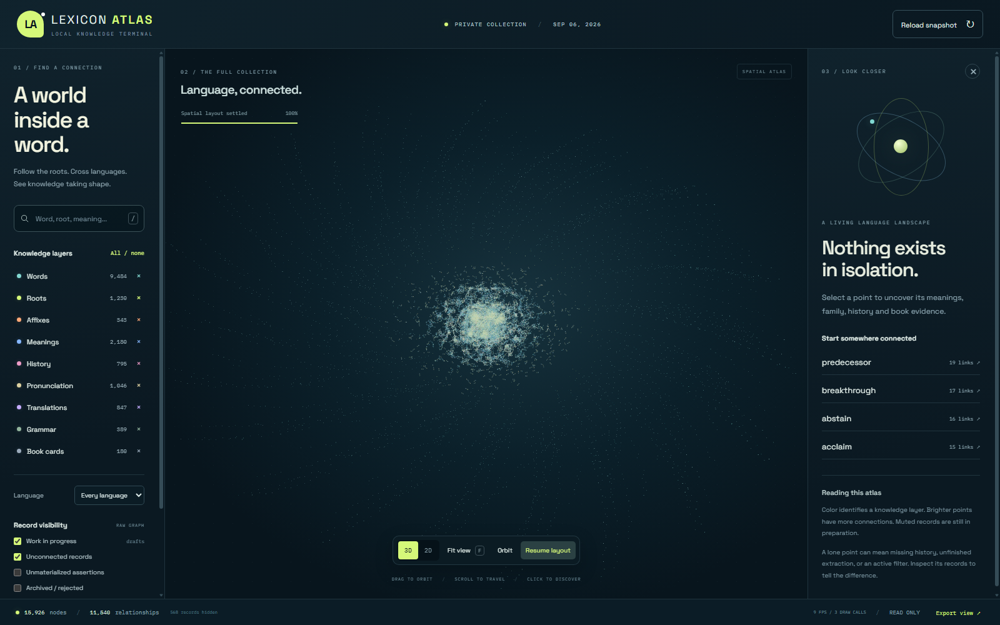

[English](../README.md) · [العربية](README.ar.md) · [Español](README.es.md) · [Français](README.fr.md) · [日本語](README.ja.md) · [한국어](README.ko.md) · [Tiếng Việt](README.vi.md) · [中文 (简体)](README.zh-Hans.md) · [中文（繁體）](README.zh-Hant.md) · [Deutsch](README.de.md) · [Русский](README.ru.md)

[](https://github.com/lachlanchen/lachlanchen/blob/main/figs/banner.png)

# Lexicon Atlas

*단어의 어근, 형태, 의미, 번역을 로컬 3차원 지식 그래프로 탐색합니다.*

[](https://github.com/lachlanchen/LexiconAtlas/releases/latest)
[](../package.json)
[](../docs/DATASET.md)
[](https://github.com/sponsors/lachlanchen)

Lexicon Atlas는 [Local Knowledge Terminal](https://github.com/lachlanchen/LocalKnowledgeTerminal)이
준비한 실제 어휘 그래프를 살펴보는 읽기 전용 브라우저입니다. 단어, 형태소, 기록된 역사적 형태, 의미,
발음, 번역, 주장과 출처 참조를 검색하고 조사할 수 있는 네트워크로 보여 줍니다. 컬렉션을 클라우드
서비스로 전송하지 않아도 됩니다.

| Donate | PayPal | Stripe |
| --- | --- | --- |
| [](https://chat.lazying.art/donate) | [](https://paypal.me/RongzhouChen) | [](https://buy.stripe.com/aFadR8gIaflgfQV6T4fw400) |

[](https://github.com/lachlanchen/LexiconAtlas/releases/latest)

*로컬 작업 스냅샷을 사용한 실제 애플리케이션 화면이며 생성된 모형이 아닙니다. 공개 릴리스에는 의도적으로 필터링한 더 작은 데이터셋이 들어 있습니다.*

## 무엇을 보여 주는가

- 단어와 레이블을 검색하고 방향성 관계를 1, 2, 3홉 이웃까지 따라갑니다.
- 어근, 접두사, 접미사, 역사적 형태, 의미, 발음, 번역, 신뢰도, 생명주기 상태와 저장된 출처 식별자를 확인합니다.
- 노드 유형, 언어, 근거 기반, 상태로 필터링하고 공간형과 평면형 레이아웃을 전환합니다.
- 현재 화면에 보이는 부분 그래프를 JSON으로 내보냅니다.
- Web Worker에서 힘 기반 레이아웃을 계산하고 Three.js로 노드와 링크를 렌더링합니다.
- 같은 인터페이스를 데스크톱과 좁은 화면 모두에 맞춥니다.

Lexicon Atlas는 저장된 주장을 시각화할 뿐, 공간적으로 가깝다는 이유로 단어의 역사를 추론하지 않습니다.
수집, 검색, 로컬 모델 보강과 수정은 LKT가 담당합니다. Atlas는 클라우드 모델을 호출하지 않고, 인용을
생성하지 않으며, 작업 그래프에 다시 쓰지 않습니다.

## 현재 공개 스냅샷

2026-09-05에 공개된 [v0.1.0](https://github.com/lachlanchen/LexiconAtlas/releases/tag/v0.1.0)은
날짜가 기록된 SQLite 데이터베이스, 매니페스트와 SHA-256 목록을 제공합니다. 매니페스트의 수치는 다음과 같습니다.

| 레코드 | 수량 | 레코드 | 수량 |
| --- | ---: | --- | ---: |
| 엔터티 | 15,925 | 용어 | 9,484 |
| 형태소 | 1,573 | 역사적 형태 | 404 |
| 의미 | 2,180 | 번역 | 847 |
| 발음 | 1,046 | 유형이 지정된 엔터티 간선 | 15,197 |
| 관계 주장 | 9,255 | 근거 레코드 | 13,431 |

용어의 주 언어는 영어입니다. 중국어, 일본어, 프랑스어와 아랍어도 포함되지만 범위는 고르지 않습니다.
`accepted`는 처리 파이프라인의 상태일 뿐 사실적 또는 언어학적 정확성을 보증하지 않습니다. 빠진 의미,
성긴 역사 기록, 중복과 잘못된 링크가 남아 있을 수 있습니다.

## 구조와 경계

```text
Local books and dictionaries
            |
       Retrieval / RAG
            |
     Local LLM preparation
            |
  LKT typed knowledge graph
            |
   Read-only SQLite snapshot
            |
       Lexicon Atlas
```

서버는 localhost에만 바인딩됩니다. 소스, 의존성, 데이터베이스를 내려받은 뒤 일반적인 탐색은 로컬에서
이루어집니다. 릴리스는 실시간으로 커지는 서비스가 아니라 고정 스냅샷이며, Atlas는 비공개 LKT 작업
데이터베이스를 대체하지 않습니다.

## 저장소 구성

| 경로 | 역할 |
| --- | --- |
| `src/main.js` | 검색, 필터, 상세 보기와 반응형 제어 |
| `src/scene.js` | WebGL 그래프 렌더링과 상호작용 |
| `src/layout.worker.js` | worker의 3차원 힘 기반 레이아웃 |
| `lib/snapshot.mjs` | 읽기 전용 SQLite 질의와 그래프 투영 |
| `server.mjs` | localhost API와 정적 자원 서버 |
| `scripts/export-public.mjs` | 허용된 열만 쓰는 그래프 스냅샷 내보내기 |
| `scripts/sync-pi.mjs` | 원격 SQLite의 일관된 백업 절차 |
| `docs/DATASET.md` | 스키마, 제외 항목, 검증과 권리 안내 |

## 빠른 시작

Git과 **Node.js 24 이상**이 필요합니다.

Windows PowerShell:

```powershell
git clone https://github.com/lachlanchen/LexiconAtlas.git
cd LexiconAtlas
npm ci
npm run build
New-Item -ItemType Directory -Force data | Out-Null
Invoke-WebRequest "https://github.com/lachlanchen/LexiconAtlas/releases/latest/download/english-word-graph.sqlite3" -OutFile "data/english-word-graph.sqlite3"
$env:LKT_GRAPH_DB = (Resolve-Path "data/english-word-graph.sqlite3").Path
npm start
```

Linux 또는 macOS:

```bash
git clone https://github.com/lachlanchen/LexiconAtlas.git
cd LexiconAtlas
npm ci
npm run build
mkdir -p data
curl -fL https://github.com/lachlanchen/LexiconAtlas/releases/latest/download/english-word-graph.sqlite3 -o data/english-word-graph.sqlite3
LKT_GRAPH_DB="$PWD/data/english-word-graph.sqlite3" npm start
```

**http://127.0.0.1:8091/** 을 열고 터미널을 계속 실행하십시오. 데이터베이스 바이너리는 `data/`나
릴리스 자산에 두며 의도적으로 Git에서 제외합니다.

## 개발과 검증

```bash
npm test
npm run build
```

테스트는 카탈로그 정규화, 스냅샷 투영, 상태 필터, 검색, 이웃 제한, 근거 그룹화와 실패 동작을 다룹니다.
빌드는 Three.js, d3-force-3d, Vite와 로컬 글꼴 패키지를 묶습니다.

## 데이터셋, 개인정보와 권리

내보내기 도구는 허용 목록의 열만 사용해 새 데이터베이스를 만듭니다. 공개 스냅샷에서는 원본 책과 사전,
본문, OCR 텍스트, 프롬프트, 문의 기록, 실행 상태, 임의 JSON과 비공개 파일 경로를 제외합니다. 출처 참조는
식별자이며 생성된 인용이 아닙니다. 무결성 및 체크섬 검사는 구조적 문제나 우발적 손상을 찾지만 각 어휘
주장의 정확성을 증명하지 않습니다.

다른 스냅샷을 게시하기 전에 [데이터셋 안내](../docs/DATASET.md)를 읽으십시오. 공유 권리가 있는 자료만
게시해야 합니다. 책 본문을 제외하더라도 출처에서 파생된 짧은 정의와 언어 설명은 별도의 권리 검토가 필요할
수 있습니다. 이 저장소에는 현재 라이선스 파일이 없으므로 공개되어 있다는 사실만으로 코드나 데이터를
재사용할 권한이 부여되지 않습니다.

## 인용

연구에서 Lexicon Atlas를 사용한다면 저장소를 인용해 주십시오. GitHub는
[CITATION.cff](../CITATION.cff)를 읽어 저장소 페이지에 **Cite this repository** 패널을 표시합니다.

```bibtex
@software{chen_lexicon_atlas_2026,
  author = {Chen, Lachlan},
  title = {Lexicon Atlas: A Local-First Three-Dimensional Lexical Knowledge Graph Explorer},
  year = {2026},
  url = {https://github.com/lachlanchen/LexiconAtlas}
}
```

## 상태

Lexicon Atlas는 개발 초기의 탐색기이며 권위 있는 어원 사전이 아닙니다. 첫 릴리스는 완전성을 주장하기보다
검사 가능성과 명시적인 빈틈을 우선합니다. 재현할 수 있는 데이터나 인터페이스 문제 제보는 유용합니다.
콘텐츠 수정은 LKT에서 먼저 진행한 뒤 새로운 필터링 스냅샷으로 내보내야 합니다.
